# Tech Stack Radar & Dependency Early-Warning System

A real-time intelligence and dependency early-warning platform that ingests raw issues, releases, and discussions from selected GitHub repositories, processes telemetry, and provides a natural-language SQL/vector assistant powered by LangChain and Gemini.

---

## 🏗 Project Architecture

```mermaid
flowchart TD
    subgraph Ingestion & Storage
        GH["GitHub REST API"] -->|httpx| Poller["src/ingestion/github_poller.py"]
        Poller -->|Raw Events JSONB| PG[("PostgreSQL 16<br>(raw_github_events)")]
        PG -->|Batch Text Chunks| Embedder["src/embeddings/indexer.py<br>(gemini-embedding-001)"]
        Embedder -->|768-dim Vectors + HNSW| PV[("PostgreSQL + pgvector<br>(issue_embeddings)")]
    end

    subgraph Multi-Node LangGraph Agent
        User["Developer / User"] <--> CLI["src/agent/cli.py<br>(Interactive Rich CLI)"]
        CLI <--> Graph["src/agent/graph.py<br>(LangGraph Workflow)"]
        
        Graph --> Router["Router Node<br>(Intent Classifier)"]
        Router -->|Structured/Counts| SQLNode["SQL Retriever<br>(Read-only SELECT)"]
        Router -->|Semantic/Bugs| VecNode["Vector Retriever<br>(pgvector Cosine Search)"]
        Router -->|Complex queries| HybNode["Hybrid Retriever"]
        Router -->|General Chat| DirNode["Direct Responder"]

        SQLNode --> Synth["Synthesizer Node<br>(Summary + GitHub Links)"]
        VecNode --> Synth
        HybNode --> Synth

        Checkpointer[("PostgreSQL Checkpointer<br>(PostgresSaver / checkpoints)")] <-->|Persistent Memory / State| Graph
    end
```



---

## 🚀 Quickstart Guide

### 1. Prerequisites
- **Python 3.10+** (virtual environment located in `.venv`)
- **Docker Desktop** (to run PostgreSQL with `pgvector` and Redpanda)
- **Google Gemini API Key** (free tier available at [Google AI Studio](https://aistudio.google.com/))

### 2. Environment Configuration (`.env`)
The `.env` file template is ready at the root of the project:
- Provide your GitHub personal access token (optional, helps prevent rate limits):
  ```bash
  GITHUB_TOKEN=ghp_...
  ```
- Add your Gemini API key:
  ```bash
  GEMINI_API_KEY=AIzaSy...
  ```

### 3. Start PostgreSQL with pgvector
Ensure Docker Desktop is running, then launch the database container:
```powershell
docker compose -f docker/docker-compose.yml up -d postgres
```

### 4. Run GitHub Issue Ingestion
Fetch the latest issues from monitored repositories (`duckdb/duckdb`, `pola-rs/polars`, `pydantic/pydantic`) and store them in PostgreSQL:
```powershell
.\.venv\Scripts\python.exe -m src.ingestion.github_poller
```

### 5. Generate Semantic Vector Embeddings (`pgvector`)
Generate 768-dimensional vector embeddings using `gemini-embedding-001` and build an HNSW index:
```powershell
.\.venv\Scripts\python.exe -m src.embeddings.indexer
```

### 6. Launch the Multi-Node AI Assistant (with Persistent State)
Start the interactive CLI to query repository technical history in natural language:
```powershell
.\.venv\Scripts\python.exe -m src.agent.cli
```

CLI Capabilities:
- **Dynamic Routing:** Automatically routes each query to SQL (`SQL`), semantic similarity (`VECTOR`), both (`HYBRID`), or direct conversation (`DIRECT`).
- **Persistent State:** Saves full conversation history and checkpoints in PostgreSQL (`PostgresSaver`).
- **Session Commands:** Type `/new` to spawn a new clean session thread or `exit` / `quit` to exit.

Sample Questions:
- *"What critical memory bugs or crash issues were reported on DuckDB?"* (Triggers semantic vector search)
- *"Show me the top 5 issues with the most comments on Polars."* (Triggers structured SQL aggregation)
- *"Are there recent regressions reported on Pydantic?"* (Triggers hybrid search)
- *"Can you provide more details about the first issue you just mentioned?"* (Demonstrates multi-turn memory)

---

## 🧪 Running Tests
```powershell
.\.venv\Scripts\python.exe -m pytest tests/
```

