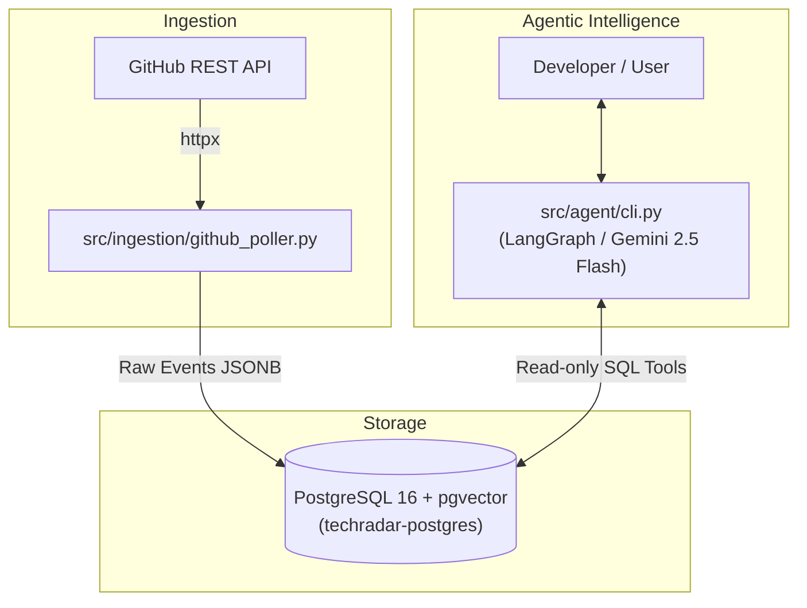

# Tech Stack Radar & Dependency Early-Warning System

A real-time intelligence and dependency early-warning platform that ingests raw issues, releases, and discussions from selected GitHub repositories, processes telemetry, and provides a natural-language SQL/vector assistant powered by LangChain and Gemini.

---

## 🏗 Project Architecture



---

## 🚀 Quickstart Guide

### 1. Prerequisiti
- **Python 3.10+** (virtual environment su `.venv`)
- **Docker Desktop** (per avviare PostgreSQL con pgvector e Redpanda)
- **Chiave API Google Gemini** (gratuita su [Google AI Studio](https://aistudio.google.com/))

### 2. Configurazione `.env`
Il file `.env` è già predisposto nella root del progetto:
- Il `GITHUB_TOKEN` è stato rilevato automaticamente dal Windows Credential Manager.
- Aggiungi la tua chiave Gemini nel file `.env`:
  ```bash
  GEMINI_API_KEY=AIzaSy...
  ```

### 3. Avviare PostgreSQL
Assicurati che Docker Desktop sia aperto su Windows, poi avvia il container:
```powershell
docker compose -f docker/docker-compose.yml up -d postgres
```

### 4. Eseguire l'Ingestion delle Issue
Scarica le ultime issue dai repository monitorati (`duckdb/duckdb`, `pola-rs/polars`, `pydantic/pydantic`) e salvale nel database:
```powershell
.\.venv\Scripts\python.exe -m src.ingestion.github_poller
```

### 5. Avviare l'Assistente AI
Avvia la chat interattiva per interrogare lo storico tecnico in linguaggio naturale:
```powershell
.\.venv\Scripts\python.exe -m src.agent.cli
```

Esempi di domande:
- *"Quali bug critici di memoria o crash sono stati segnalati su Polars?"*
- *"Mostrami le issue con più commenti o discussioni aperte su DuckDB."*
- *"Ci sono regressioni recenti segnalate su Pydantic?"*

---

## 🧪 Eseguire i Test
```powershell
.\.venv\Scripts\python.exe -m pytest tests/
```
